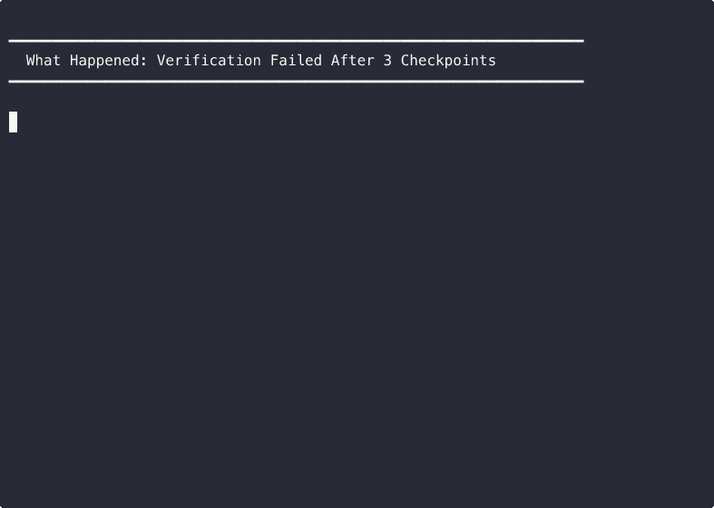
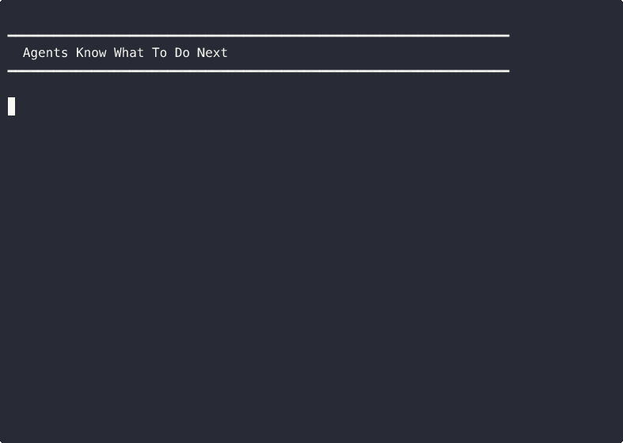

# Runr

**Stop losing 30 minutes when the agent derails.**



*When verification fails after 3 checkpoints, progress isn't lost — Runr saves verified work as git commits.*

## Quickstart (One Command)

The fastest way to start using Runr is with a meta-agent (Claude Code or Codex CLI):

```bash
# Install Runr
npm install -g @weldr/runr

# Initialize with Claude Code integration
cd your-repo
runr init --pack solo --with-claude

# Launch meta-agent (blocks if tree is dirty)
runr meta
```

The meta-agent will use Runr automatically, following workflow rules from `AGENTS.md` and `.claude/skills/`.

**If it stops:** Run the suggested command in `.runr/runs/<run_id>/handoffs/stop.json`



*Runr writes a stop handoff so agents know exactly what to do next — no guessing, no hallucinating.*

## How It Works

Runr orchestrates AI workers through phase gates with checkpoints:

```
PLAN → IMPLEMENT → VERIFY → REVIEW → CHECKPOINT → done
         ↑___________|  (retry if verification fails)
```

- **Phase gates** — Agent can't skip verification or claim false success
- **Checkpoints** — Verified milestones saved as git commits
- **Stop handoffs** — Structured diagnostics with next actions
- **Scope guards** — Files outside scope are protected

> **Status**: v0.3.0 — Renamed from `agent-runner`. Early, opinionated, evolving.

## 90-Second Demo

Want to see it work? Try the [Hello World demo](dogfood/hello-world/):

```bash
cd dogfood/hello-world
npm install
runr run --task .runr/tasks/add-farewell.md --worktree
```

Complete walkthrough in [dogfood/hello-world/README.md](dogfood/hello-world/README.md).

## Meta-Agent Quickstart (Recommended)

**The easiest way to use Runr:** One command, zero ceremony.

Runr works as a **reliable execution backend** for meta-agents (Claude Code, Codex CLI). The meta-agent operates Runr for you — handling runs, interpreting failures, and resuming from checkpoints.

### Setup (One Command)

```bash
# Install Runr globally
npm install -g @weldr/runr

# Initialize with Claude Code integration (creates AGENTS.md + .claude/ skills)
cd your-repo
runr init --pack solo --with-claude

# Verify setup
runr doctor
```

### Launch Meta-Agent

```bash
# Ensure working tree is clean (commit or stash first)
git status

# Launch Claude Code with Runr workflow context
runr meta
```

**Safety:** `runr meta` blocks if you have uncommitted changes (prevents data loss). Override with `--allow-dirty` if needed.

The meta-agent will automatically:
- Follow workflow rules from `AGENTS.md`
- Use safety playbooks from `.claude/skills/runr-workflow`
- Have `/runr-bundle`, `/runr-submit`, `/runr-resume` slash commands available

### What the Meta-Agent Does

The agent will:
1. Create task files (`.runr/tasks/your-task.md`)
2. Run `runr run --task ... --worktree`
3. Monitor progress with `runr status`
4. Handle failures, resume from checkpoints
5. Bundle evidence and submit verified work

### Why This Works

Instead of:
- "Copy this 500-line prompt and paste it into your agent"
- "Learn these CLI commands, create config files, understand phase gates"

You get:
- **One command:** `runr meta` (safe, native, zero ceremony)
- **Auto-discovered workflow:** Agent reads `AGENTS.md` + `.claude/skills/`
- **Built-in safety:** Dirty tree blocking, deletion contracts, evidence discipline

The agent becomes your operator. Runr stays the reliable execution layer.

---

## Quick Start (Direct CLI)

**⚠️ CRITICAL: Do not run agents on uncommitted work. Commit or stash first.**

```bash
# Install
npm install -g @weldr/runr

# Initialize in your project
cd /your/project
runr init --pack solo

# Check tree is clean (MUST be empty before running tasks)
git status --porcelain

# Run a task
runr run --task .runr/tasks/example-feature.md --worktree

# Submit verified checkpoint
runr bundle <run_id>
runr submit <run_id> --to dev
git push origin dev
```

**See [Solo Workflow Example](docs/examples/solo-workflow.md) for complete copy-paste reference.**

> Prefer source install? See [Development](#development).

## Configuration

Create `.runr/runr.config.json`:

```json
{
  "agent": { "name": "my-project", "version": "1" },
  "scope": {
    "allowlist": ["src/**", "tests/**"],
    "denylist": ["node_modules/**"],
    "presets": ["vitest", "typescript"]
  },
  "verification": {
    "tier0": ["npm run typecheck"],
    "tier1": ["npm run build"],
    "tier2": ["npm test"]
  }
}
```

### Scope Presets

Don't write patterns by hand:

```json
{
  "scope": {
    "presets": ["nextjs", "vitest", "drizzle", "tailwind"]
  }
}
```

Available: `nextjs`, `react`, `drizzle`, `prisma`, `vitest`, `jest`, `playwright`, `typescript`, `tailwind`, `eslint`, `env`

## CLI Reference

| Command | What it does |
|---------|--------------|
| `runr meta` | Launch meta-agent (Claude/Codex) with workflow context |
| `runr init` | Initialize config (auto-detect verify commands) |
| `runr init --pack <name>` | Initialize with workflow pack (solo/trunk) |
| `runr init --pack solo --with-claude` | Initialize with Claude Code integration |
| `runr packs` | List available workflow packs |
| `runr run --task <file>` | Start a task |
| `runr resume <id>` | Continue from checkpoint |
| `runr watch <id> --auto-resume` | Watch run + auto-resume on failure |
| `runr status [id]` | Show run state |
| `runr follow [id]` | Tail run progress |
| `runr report <id>` | Generate run report (includes next_action) |
| `runr bundle <id>` | Generate deterministic evidence bundle |
| `runr submit <id> --to <branch>` | Submit verified checkpoint to branch |
| `runr journal [id]` | Generate and display case file |
| `runr note <message>` | Add timestamped note to run |
| `runr open [id]` | Open journal in $EDITOR |
| `runr gc` | Clean up old runs |
| `runr doctor` | Check environment + meta-agent integration |

### Aliases

Same functionality, different vibe:

```bash
runr summon --task task.md   # run
runr resurrect <id>          # resume
runr scry <id>               # status
runr banish                  # gc
```

## Case Files

Every run automatically generates a **journal.md** case file in `.runr/runs/<run_id>/journal.md` containing:

- **Run metadata** (timestamps, duration, stop reason)
- **Task details** (goal, requirements, success criteria)
- **Milestone progress** (attempted, verified, checkpoints)
- **Verification history** (test attempts, pass/fail counts)
- **Code changes** (files changed, diff stats, top files)
- **Error excerpts** (last failure with redacted secrets)
- **Next action** (suggested command to continue)
- **Notes** (timestamped annotations)

### Commands

```bash
# Generate and display journal for latest run
runr journal

# Generate journal for specific run
runr journal <run_id>

# Force regeneration even if up to date
runr journal <run_id> --force

# Add a timestamped note to latest run
runr note "Debugging OAuth token refresh issue"

# Add note to specific run
runr note "Fixed token refresh" --run-id <run_id>

# Open journal in $EDITOR (defaults to latest run)
runr open
runr open <run_id>
```

**Note**: If `<run_id>` is omitted, all commands default to the most recent run in the repository.

### Auto-Generation

Journals are automatically generated when runs complete (stop or finish). You can also:
- Manually regenerate with `runr journal <run_id> --force`
- Add timestamped notes during or after runs with `runr note` (stored in `.runr/runs/<run_id>/notes.jsonl`)
- Open in your editor with `runr open` (uses `$EDITOR` or `vim`)

**Use case**: Share run context with collaborators, document debugging sessions, track experiment results.

**Files generated:**
- `journal.md` - Human-readable case file
- `notes.jsonl` - Timestamped notes (one JSON object per line)

## Task Files

Tasks are markdown files:

```markdown
# Add user authentication

## Goal
OAuth2 login with Google.

## Requirements
- Session management
- Protected routes
- Logout functionality

## Success Criteria
- Users can log in with Google
- Session persists across refreshes
```

## Stop Reasons

When Runr stops, it tells you why:

| Reason | What happened |
|--------|---------------|
| `complete` | Task finished. Ship it. |
| `verification_failed_max_retries` | Tests failed too many times |
| `guard_violation` | Touched files outside scope |
| `review_loop_detected` | Reviewer kept requesting same changes |
| `time_budget_exceeded` | Ran out of time |

Every stop produces `stop.json` + `stop.md` with diagnostics.

## Philosophy

This isn't magic. Runs fail. The goal is understandable, resumable failure.

This isn't a chatbot. Task in, code out.

This isn't a code generator. It orchestrates generators.

Agents lie. Logs don't. If it can't prove it, it didn't do it.

## Migrating from agent-runner

| Old | New |
|-----|-----|
| `agent` CLI | `runr` CLI |
| `.agent/` directory | `.runr/` directory |
| `agent.config.json` | `runr.config.json` |
| `.agent-worktrees/` | `.runr-worktrees/` |
Old paths still work for now, with deprecation warnings.

## Development

```bash
npm run build    # compile
npm test         # run tests
npm run dev -- run --task task.md  # run from source
```

## Release History

| Version | Date | Highlights |
|---------|------|------------|
| v0.3.0 | **Renamed to Runr**, new CLI, new directory structure |
| v0.2.2 | Worktree location fix, guard diagnostics |
| v0.2.1 | Scope presets, review digest |
| v0.2.0 | Review loop detection |
| v0.1.0 | Initial stable release |

See [CHANGELOG.md](CHANGELOG.md) for details.

## Contributing

See [CONTRIBUTING.md](CONTRIBUTING.md).

## License

Apache 2.0 — See [LICENSE](LICENSE).

---

<sub>Existence is pain, but shipping is relief.</sub>
