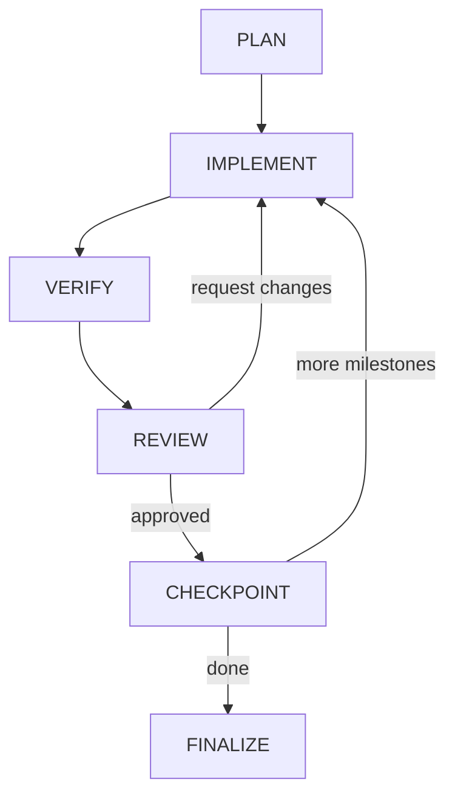

Status: Implemented
Source: src/supervisor/runner.ts, src/commands/run.ts, src/store/run-store.ts

# Run Lifecycle

## Phase flow
```
PLAN -> IMPLEMENT -> VERIFY -> REVIEW -> CHECKPOINT -> FINALIZE
```

Mermaid:


## Phase definitions
- PLAN: Claude generates a milestone plan and writes `plan.md`.
- IMPLEMENT: Codex executes the current milestone and writes a handoff memo.
- VERIFY: Tiered commands run; failure stops the run.
- REVIEW: Claude reviews diff and verification output; may request changes.
- CHECKPOINT: Commits changes and records the checkpoint SHA.
- FINALIZE: Writes a summary and stop memo, then stops the run.

## Tick-based execution
- The supervisor loop runs one phase per tick.
- `--max-ticks` limits how many phases execute per run/resume.
- `--time` caps total runtime across all ticks.

## Run IDs and branches
- Run IDs use UTC timestamps: `YYYYMMDDHHMMSS`.
- Run branch format: `agent/<run_id>/<slug>`.
- Branch checkout is skipped when `--no-branch`, `--dry-run`, or `--no-write` is set.

## Stop conditions
- Guard violations (preflight or post-implement). See [Guards and Scope](guards-and-scope.md).
- Verification failure after max retries (3 attempts per milestone). See [Verification](verification.md).
- JSON parse failure from workers. See [Workers](workers.md).
- Time budget exceeded.
- Implementer reports `blocked` or `failed`.

## See Also
- [Run Store](run-store.md) - Where run artifacts are persisted
- [Architecture](architecture.md) - Component overview
- [CLI Reference](cli.md) - Command options for controlling runs
