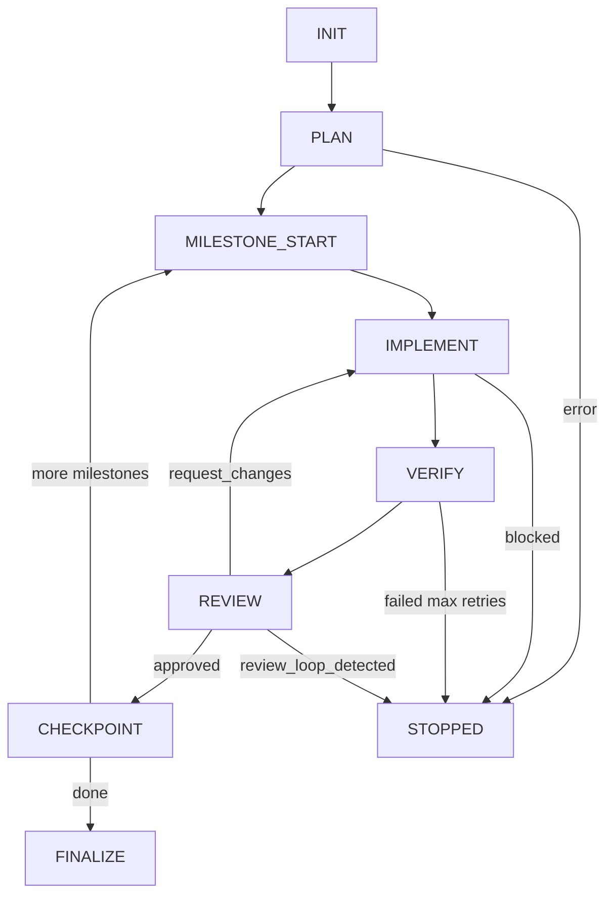

# Run Lifecycle

## Phase Flow

```
INIT → PLAN → MILESTONE_START → IMPLEMENT → VERIFY → REVIEW → CHECKPOINT → FINALIZE
                    ↑                                    ↓
                    └────────────── (more milestones) ───┘
```



## Phases

| Phase | Description |
|-------|-------------|
| `INIT` | Initialize run state, create worktree if needed |
| `PLAN` | Worker generates milestone plan with file scopes |
| `MILESTONE_START` | Begin next milestone |
| `IMPLEMENT` | Worker executes current milestone |
| `VERIFY` | Run tier0/tier1 verification commands |
| `REVIEW` | Worker reviews diff and verification output |
| `CHECKPOINT` | Commit changes, advance milestone counter |
| `FINALIZE` | Write summary, cleanup |
| `STOPPED` | Terminal state (error or `review_loop_detected`) |

## Terminal States

Runs end in one of:

- **FINALIZE** - Completed successfully
- **STOPPED** - Stopped due to error, guard violation, or loop detection

The `stop_reason` field in `state.json` indicates why:

| Stop Reason | Description |
|-------------|-------------|
| `complete` | All milestones finished |
| `time_budget_exceeded` | Ran out of time |
| `max_ticks_reached` | Hit tick limit |
| `guard_violation` | Scope or lockfile violation |
| `plan_scope_violation` | Plan proposed files outside allowlist |
| `review_loop_detected` | Reviewer requested same changes repeatedly |
| `verification_failed_max_retries` | Tests/lint failed too many times |
| `implement_blocked` | Implementer couldn't proceed |

## Tick-Based Execution

- The supervisor loop runs one phase per tick
- `--max-ticks` limits phase transitions per run (default: 50)
- `--time` caps total runtime in minutes (default: 120)

## Run IDs and Branches

- Run IDs use UTC timestamps: `YYYYMMDDHHMMSS`
- Run branch format: `agent/<run_id>/<slug>`
- With `--worktree`: isolated git worktree per run

## Fast Path

With `--fast` flag:
- Skips PLAN phase (single implicit milestone)
- Skips REVIEW phase
- Useful for small, low-risk tasks

## See Also

- [Run Store](run-store.md) - Where artifacts are persisted
- [Guards and Scope](guards-and-scope.md) - Scope constraints
- [Verification](verification.md) - Test tier selection
- [CLI Reference](cli.md) - Run command options
